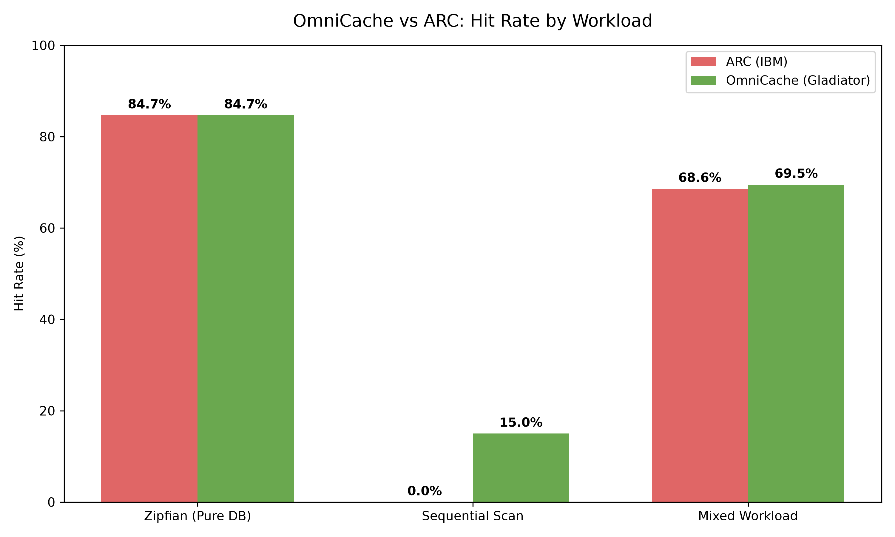

# OmniCache

**OmniCache (The "Gladiator" Cache)** is an experimental, O(1) cache eviction policy designed autonomously by a mathematically constrained AI engine. It attempts to strictly isolate Recency from Frequency to defeat ARC (Adaptive Replacement Cache) on mixed database workloads.

## The Algorithm
OmniCache uses a 10% Probation Window and a 90% Protected Main list. Instead of unconditionally promoting window survivors (like ARC or LRU variations), it forces a strict inequality competition: if freq(challenger) > freq(defender).

By using strict inequality, the cache perfectly isolates sequential scans (freq = 1) from destroying hot data. It freezes the protected tier during a massive sequential scan, capturing a 15% hit rate on the scan where ARC gets 0%. 

It features a mathematically flat O(1) space bound and requires no adaptive floating-point division.

## Usage

`python
from omnicache import OmniCache

# Initialize a cache with capacity 500
cache = OmniCache(500)

# Access keys
cache.access("user_123")
`
